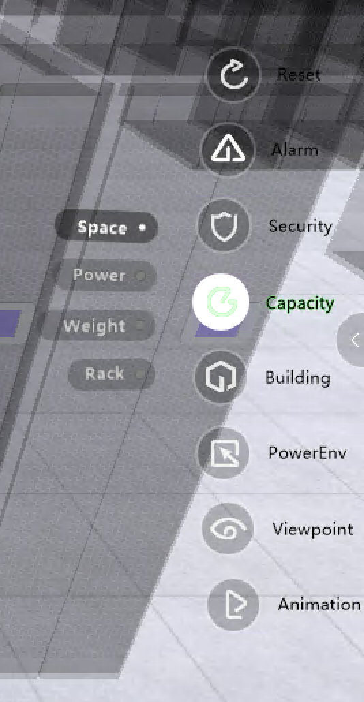

***********************
 Analysis
***********************

Overview
=========

uDCV provides various analysis functions which can be accessed by mouse over right navigation bar.

.. note::

   Certain analysis functions only available in specific layer(s), for instance, ``Electronic Wire`` only available on building layer.

Analysis Functions
===================

uDCV provides following analysis functions:

.. csv-table:: **Analysis Functions**
    :header: Function Category, Description
    :widths: 30, 70

    Reset, "Reset all analysis effects"
    Alarm, "Alarm filter"
    Security, "Identify security devices by category"
    Capacity, "Capacity analysis on space, power, etc."
    Building, "Show building level objects"
    PowerEnv, "Environment related analysis functions such as heatmap, airflow, sensors, etc."
    Viewpoint, "Viewpoint shortcuts"
    Animation, "animation shortcuts"

