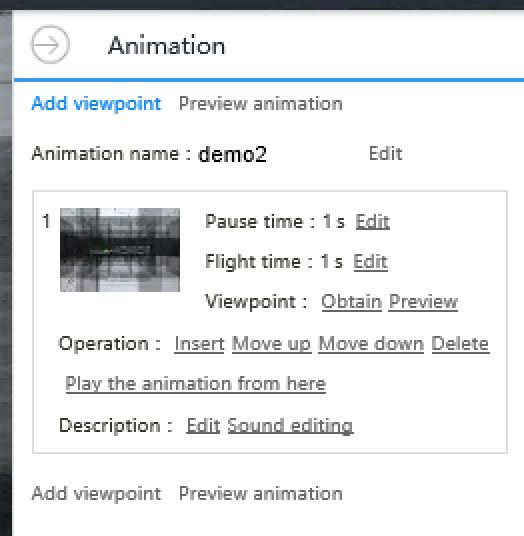

****************************
 Animation
****************************

Concept
========

User can define multiple ``viewpoint`` in 3D scene, uDCV **connect** those viewpoints automatically and produce an ``animation``.  

Create Animation
=================

1. From left navigation bar, click ``Demo`` --> ``Animation`` --> ``Create animation``

2. Click ``Edit`` button to enter animation authoring UI

3. Add viewpoints, setting ``fly`` and ``pause`` parameter, as well as adjust the order of viewpoint **frame** for current animation.
   

Preview Animation
=================

Click ``priview animation`` to priview current animation.

Set as Default Animation
=========================

From animation list, click ``set as default animation`` button to set animation as default animation. Default animation can be play directly from top right navigation bar.

Play Animation
================

* Play **Default** animation by click ``Animation`` button on the top right navigation bar
* Select animation to play by mouse over right navigation bar, then select ``Animation`` --> ``{{name of the animation}}``

