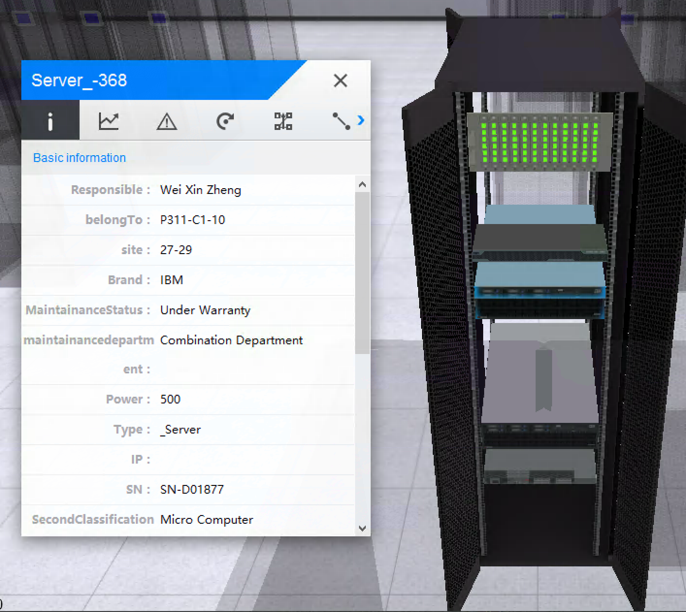
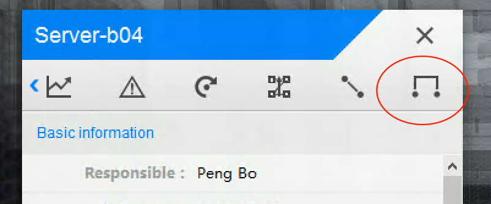
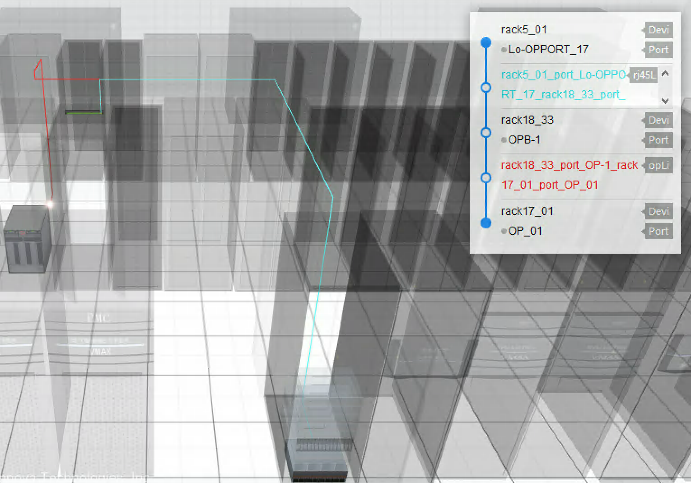

***********************
 Device
***********************

uDCV supports consolidate and visualize device information in 3D.

Device Information Panel
========================
Single click device in a opened cabinet to show device information panel, as shown below:

Switch to different tab to view various information about the device.

Wiring Information
====================

Click on ``link`` tab to show device connection (if any).

uDCV supports display linkage as multiple hops, select and fly to peer device/port by click link item on popup link information panel.

