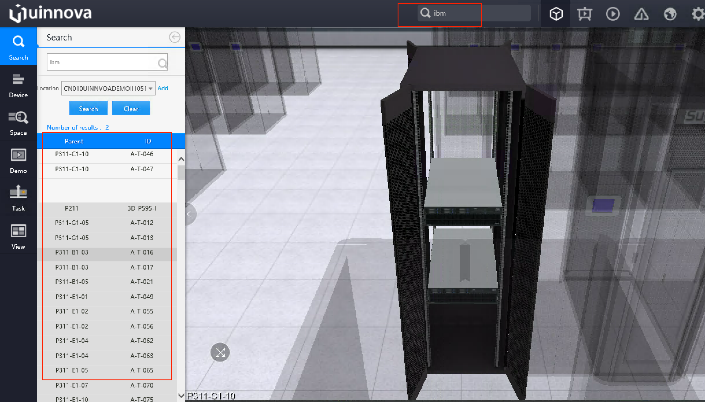
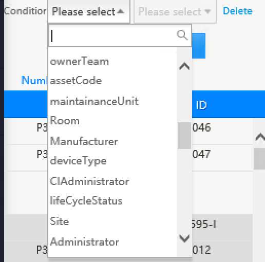
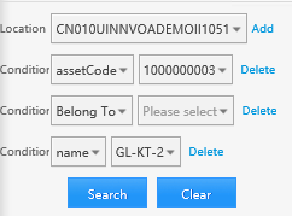

***********************
Search
***********************

uDCV supports **full-text search**, as well as multiple criteria search which allow more specific scoping.

Basic Search
=============

Enter keyword in upper search box and hit enter, search result UI will appears automatically on the left. Single click on one result item(if any), system will fly camera to the item. As shown below:

.. note::

   Search box use **full-text search**, any match on object properties will return as result, for instance, enter "HP" will shows all HP servers, storages and printers, and server room name includes "HP", etc.

Advance Search
===============

To reduce the search scope, user can specify multiple condition on **Advance Search**. **Advance Search** is located at left navigation bar.

* All Object properties can be used as search criteria :

* Support ``AND`` operator between search criteria

