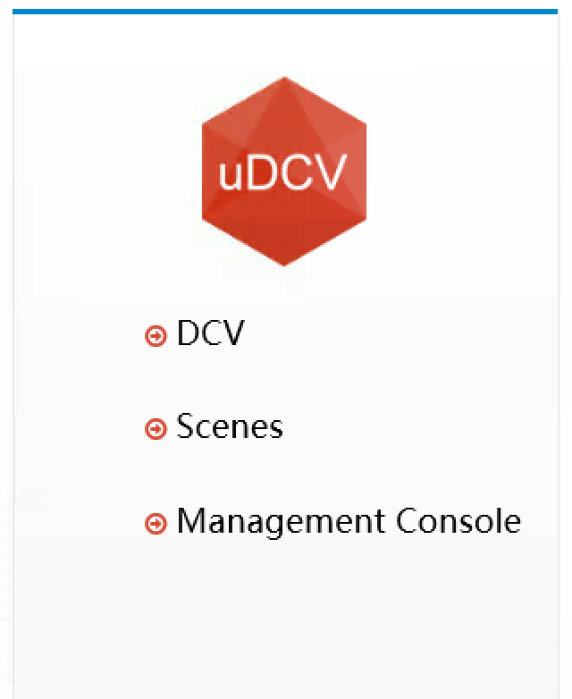
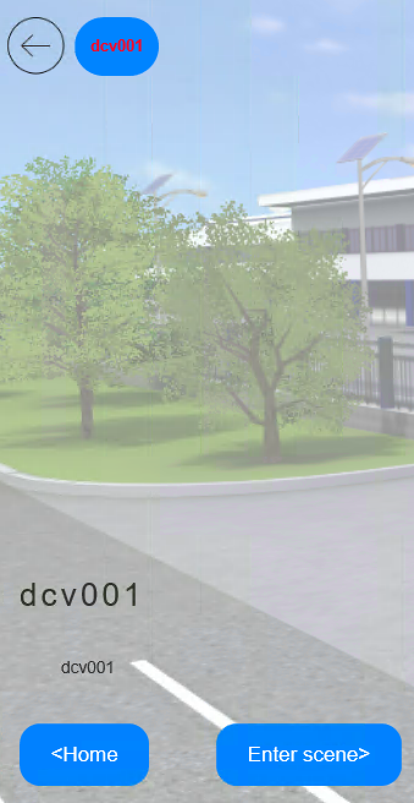
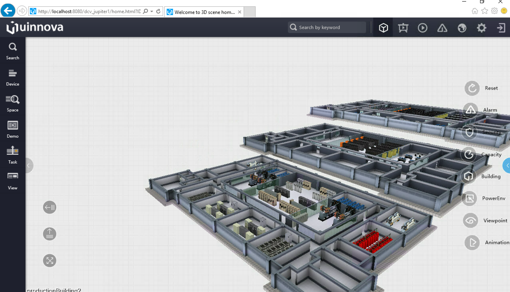

***********************
UI Walk Thought
***********************

About Scenes
================

uDCV support hosts multiple 3D datacenter models, or ``Scenes``, and each scenes may has its own model library, configure, asset ans wiring data.

View Scene List
^^^^^^^^^^^^^^^^

Click ``Scenes`` link on main page to view scene list.

Enter 3D Scene
^^^^^^^^^^^^^^^

Select scene and click ``enter scene`` button

.. note::

   User may be prompted to install T3D plugin while open 3D scene for the first time.

Navigation in 3D scene View
===============================

There are 4 major UI areas in 3D scene view:

.. csv-table:: **3D Scene UI Area**
    :header: Area Position, Function Description
    :widths: 30, 70

    Top Navigation Bar, "Search Box, Alarm Switch, Shortcut to Management Console, Home"
    Left Navigation Bar, "Advance Search, Space Search, Task Management, Animation"
    Right Navigation Bar, "Analysis Function Shortcuts"
    Central, "3D Scene"

|

