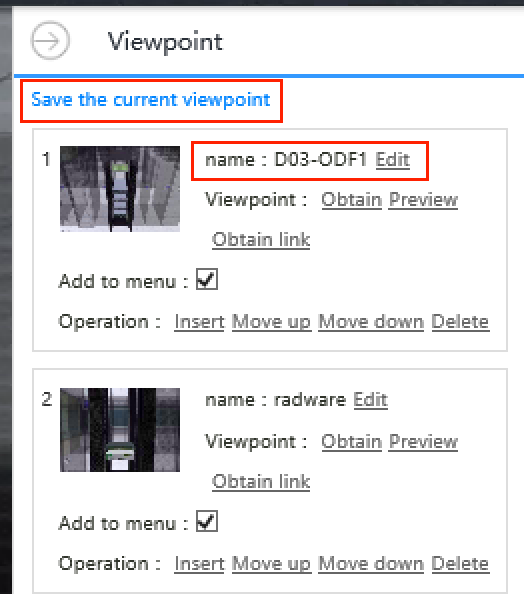
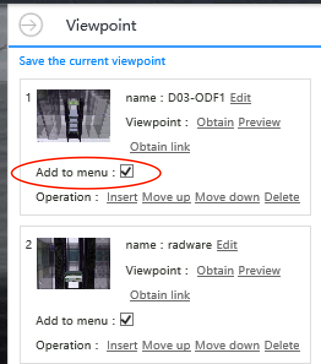
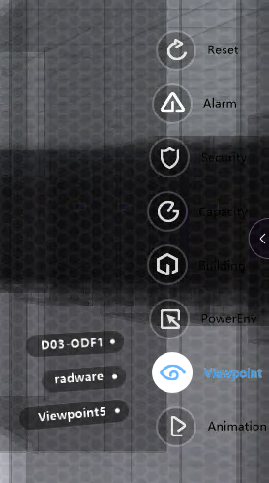

***********************
 Viewpoint
***********************

Concept
=========
Viewpoint are shortcuts to an specific view of 3D scene. For complex scenes, e.g. multi-stories, multi-rooms datacenter, viewpoint is handy to fly to the point of interest by one single click.

Create Viewpoint
==================
1. Navigate 3D scene to a point of interest.
2. From left navigation bar, click ``Demo`` --> ``View``
3. Click ``Save the current viewpoint``

4. Set the name of viewpoint.
6. Click ``Add to menu`` check-box.

Access Saved Viewpoint
=======================
Mouse over to show right navigation bar, then select ``Viewpoint`` --> ``{{name of the viewpoint}}``

